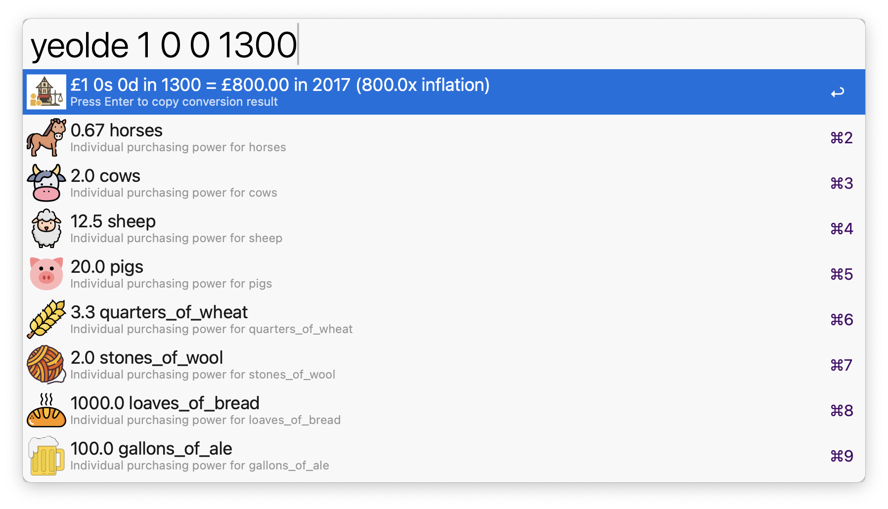

# Ye Olde Exchange 💷

An [Alfred](https://www.alfredapp.com/) workflow that converts an old UK amount in pounds,
shillings and pence from any year between 1270 and 2017 into its modern value, and shows what
it would have bought at the time.

<a href="https://github.com/giovannicoppola/alfred-YeOldeExchange/releases/latest/">
 
</a>

## Installation

Download the latest `.alfredworkflow` from [Releases](https://github.com/giovannicoppola/alfred-YeOldeExchange/releases/latest)
and double-click it. Requires Alfred with the Powerpack and Python 3 (`/usr/bin/python3`, which
macOS installs with the Command Line Tools). Everything else is bundled.

## Usage

Type `yeolde` followed by four numbers: **pounds** (0–999), **shillings** (0–19), **pence**
(0–11) and **year** (1270–2017). `£5 10s 6d 1850` and `5/10/6 1850` work too.

| Query | Result |
|---|---|
| `yeolde 5 10 6 1850` | £5 10s 6d in 1850 = £442.00 in 2017 (80.0x inflation) |
| `yeolde 1 0 0 1600` | £1 0s 0d in 1600 = £200.00 in 2017 (200.0x inflation) |
| `yeolde 2 5 8 1400` | £2 5s 8d in 1400 = £1,370.00 in 2017 (600.0x inflation) |

The first row is the conversion; the rows below show what the amount bought in that year —
horses, cows, sheep, pigs, quarters of wheat, stones of wool, loaves of bread and gallons of
ale. <kbd>↩</kbd> copies any row.

### Pre-decimal money

Before 1971: **£1 = 20 shillings (s)** and **1 shilling = 12 pence (d)**, so £1 = 240d.

## About the numbers

Inflation multipliers and historical prices are approximations interpolated from published
series (in the spirit of the National Archives' currency converter), not an official dataset.
Treat them as an educational ballpark. No network access is needed.

## Credits

Icons from [flaticon.com](https://www.flaticon.com/).

# Changelog
- 2026-09-27: version 0.1.0, one process per keystroke (the converter is imported, not spawned),
  result order no longer reshuffled by Alfred, readable item names, `£5 10s 6d` and `5/10/6`
  input accepted, clearer prompts; repo reorganised under `source/`
- 2026-07-21: version 0.0.2, fixed the backend script path so conversion works regardless of the launch directory
- 2025-07-08: version 0.0.1, initial release
